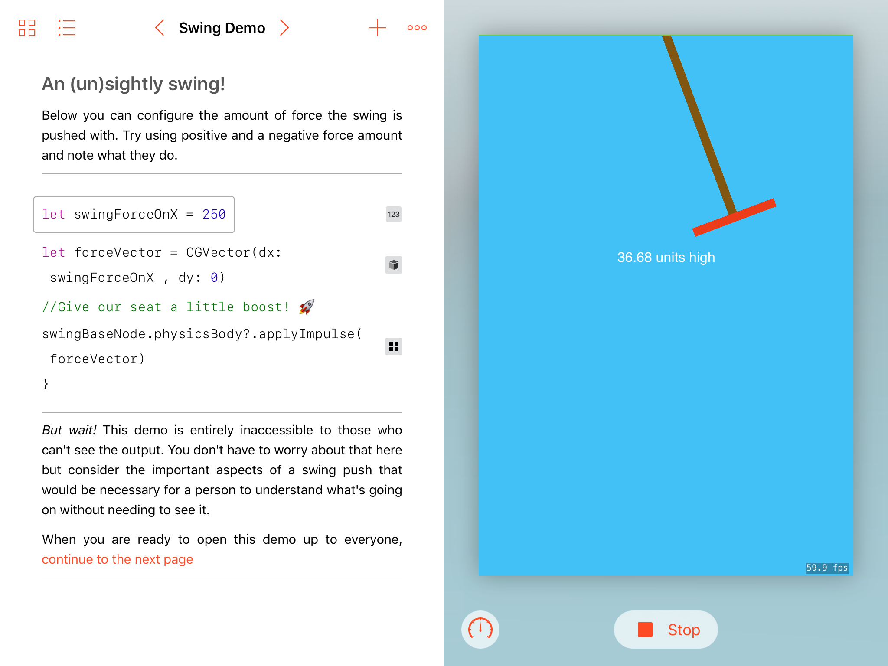

  

# Vision: A Playground Book

For my WWDC 2017 scholarship application I made a playground book about accessibility in iOS, specifically issues surrounding that of games. Games on iOS rarely have support for VoiceOver because developers rarely even remember that it exists.

You will want to download `Vision.playgroundbook` to run this. I developed this in separate files and used the `SyncPlaygroundToBook.command` to sync them all together.

Below I’ve included my wrap up that I included at the end of my playground. In it I explain the issues I address and the importance of accessibility support.

---

iOS has a long history of accessibility yet most of the usability in apps that users enjoy is a result of the system's automatic, silent aid. Many developers aren’t aware of its existence and importance and so their UI becomes painful if not impossible to navigate with VoiceOver.
 
 The tools to make every type of application accessible already exist. Those with poor and limited vision are often left unable to use software that employs high tech and flashy design simply because no one invested the time to integrate the application properly.
 
 ---
 
 
>“It’s the right thing to do”
 
 The iOS Accessibility Guidelines suggests deep integration because when making software we have a moral obligation to *do it right*. While you may not know anyone who uses a screenreader or other low vision tools, it’s vital to ensure that your apps are not just beautifully designed but beautifully designed for all. Accessibility has never been a lucrative business decision. It’s often thankless: the vast majority of people don’t rush to download an update because it has greater accessibility support. Most users won’t even know how to access such features. 

Accessibility is an investment in our world community. Sure, most people will never know it’s there but it will undoubtedly make someone’s life better — and isn’t that what technology is for, anyways?

---

[Video demo](https://www.youtube.com/watch?v=dRcC0TVG4tc&feature=youtu.be)

